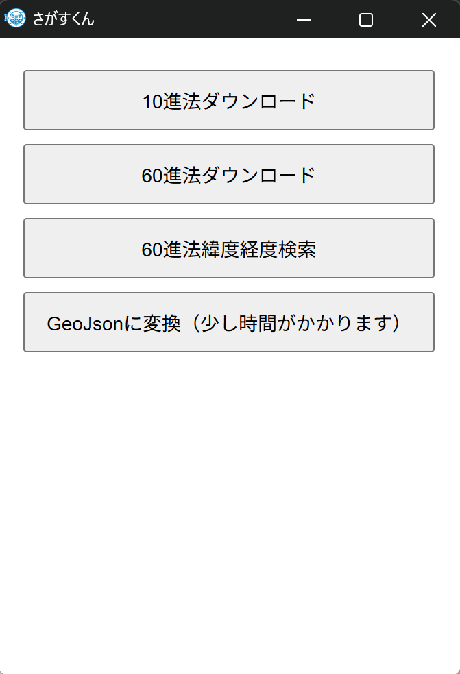

# 海保データ変換ツール 

海保のデータを変換し緯度、経度で検索します。

## 概要

- このプロジェクト
- なぜこのプロジェクトが必要なのか？
- 主な機能は何か？

## インストール方法

以下の手順でプロジェクトをローカル環境にインストールしてください。

[インストール](https://github.com/TokaiScienceClub/Deep-Sea-Data/releases/tag/0.0)する。
